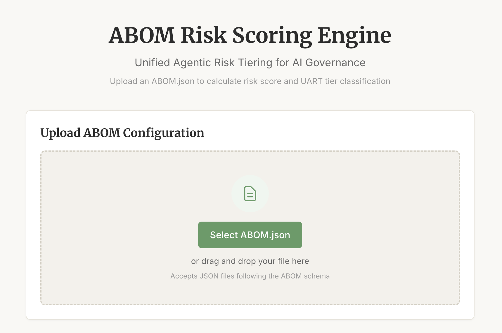
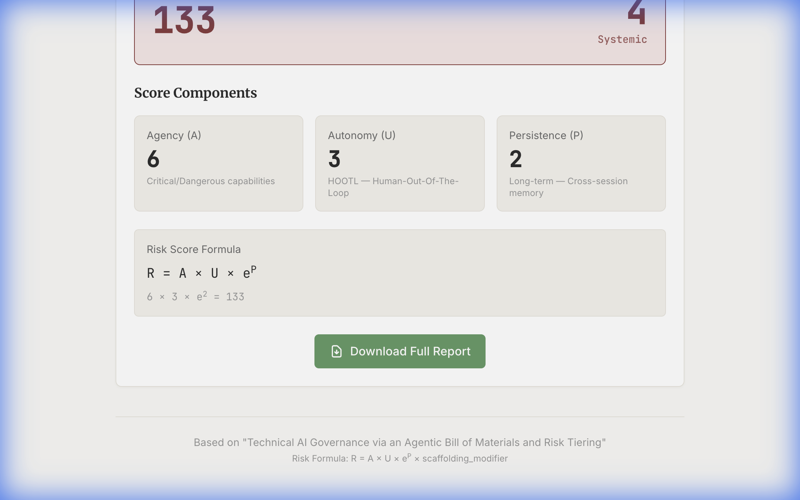

# ABOM Risk Scoring Engine — User Tutorial

This tutorial walks you through using the ABOM Risk Scoring Engine to assess agentic AI risk.

---

## Quick Start

### 1. Start the Backend

```bash
cd backend
pip install -r requirements.txt
uvicorn main:app --reload --port 8000
```

### 2. Start the Frontend

```bash
cd frontend
npm install
npm run dev
```

### 3. Open the Dashboard

Navigate to **http://localhost:3000** in your browser.

---

## Using the Dashboard

### Step 1: Upload Your ABOM File

The home screen shows the upload area. Click **"Select ABOM.json"** or drag and drop your file.



Your ABOM file should be a JSON file following this structure:

```json
{
  "model_core": {
    "architecture": "Transformer",
    "training_flops": "1e23"
  },
  "agency_profile": {
    "tools": [
      {"name": "Database", "permission": "write"}
    ],
    "capability_flags": []
  },
  "autonomy_leash": {
    "mode": "HOTL"
  },
  "persistence_layer": {
    "memory_type": "session",
    "retention": "session-only"
  },
  "scaffolding_inventory": {
    "mcp_used": true,
    "sandboxed": true
  }
}
```

---

### Step 2: Review Your Results

After uploading, you'll see the risk assessment:



The results show:

| Field | Description |
|-------|-------------|
| **Risk Score** | Calculated as R = A × U × e^P × modifier |
| **UART Tier** | 0-4 classification (Passive → Systemic) |
| **Agency (A)** | 1-6 based on tool capabilities |
| **Autonomy (U)** | 1-3 based on human oversight level |
| **Persistence (P)** | 0-2 based on memory duration |

---

## Understanding UART Tiers

| Tier | Name | Risk Level | Description |
|------|------|------------|-------------|
| 0 | Passive | Minimal | No tools, read-only |
| 1 | Assistive | Low | Limited tools, human-in-the-loop |
| 2 | Bounded | Moderate | Semi-autonomous with guardrails |
| 3 | High-Agency | High | Autonomous with monitoring |
| 4 | Systemic | Critical | Infrastructure-critical or extreme capabilities |

---

## Tier 4 Overrides

The system automatically elevates to **Tier 4** if:

1. **Training FLOPs ≥ 10²⁵** (EU AI Act systemic risk threshold)
2. **Dangerous capability flags** are present:
   - `self-replication`
   - `cbrn` (chemical, biological, radiological, nuclear)
   - `autonomous_weapons`
   - `critical_infrastructure_control`

When triggered, you'll see a red warning banner explaining why.

---

## Scaffolding Modifiers

Safety controls reduce your risk score:

| Control | Risk Reduction |
|---------|----------------|
| MCP (Model Context Protocol) | 10% |
| Sandboxing | 15% |
| Circuit breakers / Kill switch | 10% |

Maximum combined reduction: **30%**

---

## Download Report

Click **"Download Full Report"** to get a JSON file with the complete assessment, including:
- Original ABOM input
- All calculated scores
- Tier classification
- Override reasons (if any)

---

## Example Test Cases

The `tests/` folder contains example ABOM files:

| File | Expected Tier |
|------|---------------|
| `test_case_1_minimal_risk.json` | Tier 1 |
| `test_case_2_low_risk.json` | Tier 2 |
| `test_case_3_moderate_risk.json` | Tier 3 |
| `test_case_4_high_risk.json` | Tier 4 (FLOPs override) |
| `test_case_5_critical_risk.json` | Tier 4 (FLOPs override) |
| `test_case_6_tier4_override.json` | Tier 4 (FLOPs + capability flags) |

Try uploading these to see how different configurations affect the risk score.
